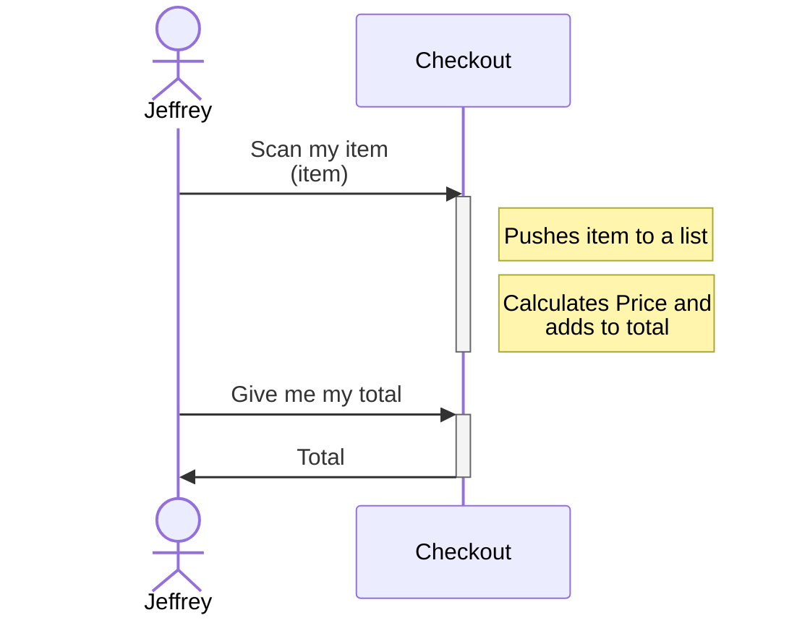
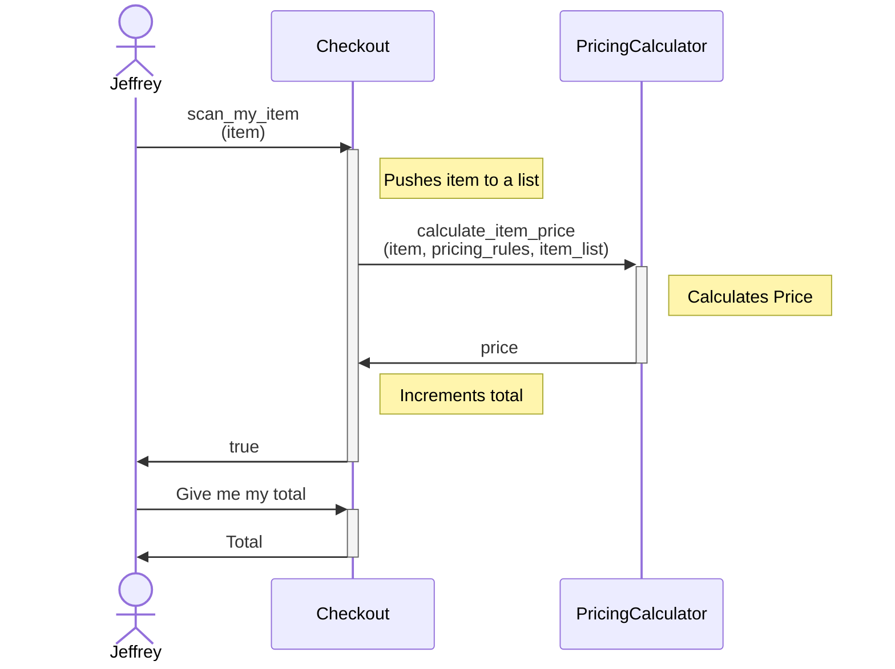

## Current Implementation

```mermaid
sequenceDiagram
    actor Jeffrey
    participant Checkout
    Jeffrey->>Checkout: Scan my item <br> (item)
    activate Checkout
    Note right of Checkout: Pushes item to a list
    Note right of Checkout: Calculates Price and <br> adds to total
    deactivate Checkout

    Jeffrey->>+Checkout: Give me my total
    Checkout->>-Jeffrey: Total
```

---

## Design Thoughts

```mermaid
sequenceDiagram
    actor Jeffrey
    participant Checkout
    participant PricingCalculator
    Jeffrey->>Checkout: scan_my_item <br> (item)
    activate Checkout
    Note right of Checkout: Pushes item to a list
    Checkout->>+PricingCalculator: calculate_item_price <br> (item, pricing_rules, item_list)
    Note right of PricingCalculator: Calculates Price
    PricingCalculator->>-Checkout: price 
    Note right of Checkout: Increments total
    Checkout->>-Jeffrey: true

    Jeffrey->>+Checkout: Give me my total
    Checkout->>-Jeffrey: Total
```